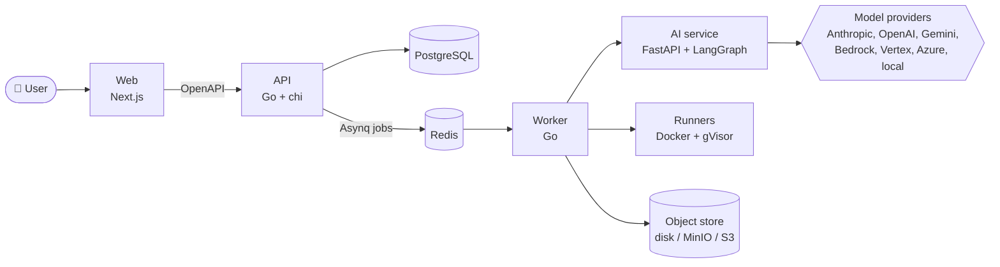

<div align="center">

# 🧪 Qavia

### Your AI QA engineer. Upload a spec, get tested software.

<p>
  
  
  
  
  
  
</p>

<p>
  <a href="#-what-it-does">What it does</a> •
  <a href="#-architecture">Architecture</a> •
  <a href="#-quick-start">Quick start</a> •
  <a href="#-make-targets">Make targets</a> •
  <a href="#-documentation">Docs</a>
</p>

</div>

---

## ✨ What it does

Qavia is an internal Hyscaler platform that acts as an **AI QA engineer**.

A user logs in, creates a project, picks the kinds of tests they want, uploads what the system needs, and submits. Then Qavia works in the background:

1. 📥 **Understands** the input: requirements, API specs, or a code repository
2. 📝 **Generates** test cases and runnable test code
3. 🐳 **Executes** the tests in isolated, sandboxed containers
4. 🔍 **Analyses** failures and files defects
5. 🔔 **Notifies** the user when it is done

No babysitting required.

## 🧭 Design principles

| | Principle | In practice |
|---|---|---|
| ⚙️ | **Configuration lives in the UI** | Only a handful of bootstrap env vars. Everything else is a DB setting resolved `user → project → global → default`. |
| 🔌 | **Every external platform is optional** | Jira, Slack, SMTP, GitHub, S3 and MCP servers are enhancements. An empty integrations table still works. |
| 🎯 | **AI only where it earns its place** | Spec parsing, diffing, coverage, flake detection and cost accounting stay deterministic code. |
| 🎚️ | **Agents ask for a tier, not a model** | Prompts request `reasoning`, `code`, `cheap` or `vision`. Switching providers is a dropdown, not a deploy. |
| 🏗️ | **Built-in path first** | Internal defect tracker before Jira, local disk before S3, in-app notifications before email. |
| 🔗 | **Traceability from day one** | Artifact hashes, versions, requirement IDs and test fingerprints ship in Phase 0. |

## 🏛️ Architecture



### Tech stack

| Layer | Choice |
|---|---|
| API, worker, runner | Go, `net/http` + chi |
| API contract | OpenAPI 3.1, spec-first, `oapi-codegen` |
| AI service | Python, FastAPI, LangChain + LangGraph + Pydantic |
| Web | Next.js (App Router), React, Tailwind, shadcn/ui, TanStack Query |
| Database | PostgreSQL, sqlc over pgx v5, goose migrations |
| Queue | Asynq on Redis |
| Object storage | Local disk, MinIO, or S3 |
| Test execution | Docker with gVisor |
| Auth | Argon2id, server-side sessions |
| Observability | `log/slog` JSON logs, OpenTelemetry |

## 📁 Repository layout

```text
.
├── api/              Go API server, worker, and CLI tools
│   ├── cmd/          api, worker, adminreset, rotatekey, runnercheck
│   ├── internal/     domain packages (auth, analyses, artifacts, audit, ...)
│   ├── migrations/   goose SQL migrations
│   ├── queries/      sqlc queries
│   └── openapi/      the API contract
├── services/ai/      Python AI service (FastAPI, uv)
├── web/              Next.js frontend
├── infra/docker/     local stack and sandboxed test runners
│                     (playwright, node, python, k6, security, mock server)
├── scripts/          schema dump helpers
├── docs/             requirements, plans, standards, architecture
└── Makefile          one entry point for every toolchain
```

## 🚀 Quick start

### Prerequisites

- Go 1.25+
- Python 3.12+ with [uv](https://docs.astral.sh/uv/)
- Node.js 24 (see `.nvmrc`) with pnpm
- Docker with Compose

### Run it

```bash
# 1. Configure the bootstrap environment
cp .env.example .env
openssl rand -base64 32   # paste into APP_ENCRYPTION_KEY

# 2. Install the pinned code generators
make tools

# 3. Start the stack, migrate, and run the API, worker, and AI service
make dev
```

### Local services

| Service | Address |
|---|---|
| API | `localhost:8080` |
| AI service | `localhost:8000` |
| PostgreSQL | `localhost:55432` |
| Redis | `localhost:56379` |
| MinIO | `localhost:59000` (console `59001`) |

Ports are deliberately off the defaults so the stack coexists with a locally installed Postgres or Redis.

## 🛠️ Make targets

Run `make help` for the full list.

| Target | What it does |
|---|---|
| `make up` / `make down` | Start or stop Postgres, Redis, and MinIO |
| `make reset` | Stop the stack and delete its data |
| `make dev` | Stack + migrations + API, worker, and AI service |
| `make gen` | Regenerate sqlc, AI schema, and API code (CI fails on a diff) |
| `make migrate-up` | Apply all migrations |
| `make migrate-new name=x` | Create a new migration |
| `make build` | Build the binaries |
| `make test` | Run Go, Python, and web test suites |
| `make lint` | Lint everything |
| `make seed` | Seed the demo project |
| `make mock` | Serve the OpenAPI contract as a mock API |
| `make rotate-key` | Re-encrypt every stored secret under a new key |

## 📚 Documentation

Start at **[docs/README.md](docs/README.md)**, the master document.

| Document | Answers |
|---|---|
| [requirements.md](docs/requirements.md) | *What* must be built |
| [features.md](docs/features.md) | *Which* features exist, across 17 modules |
| [ai-architecture.md](docs/ai-architecture.md) | *How* the AI layer works |
| [tech-stack.md](docs/tech-stack.md) | *Why* each technology was chosen |
| [backend-standards.md](docs/backend-standards.md) | *How* to write the backend |
| [plan.md](docs/plan.md) | *In what order* it gets built |
| [work.md](docs/work.md) | *Who does what, next* |
| [error-codes.md](docs/error-codes.md) | API error catalogue |
| [competitors.md](docs/competitors.md) | *Who else* does this |

**New here?** Read `docs/README.md` → `tech-stack.md` → `backend-standards.md` → your task in `work-backend.md` or `work-frontend.md`.

---

<div align="center">
<sub>Built at <b>Hyscaler</b></sub>
</div>
